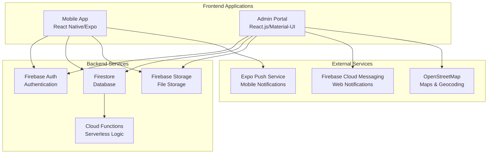

# 🏛️ JanSahyog - Smart Civic Issue Management System

[](https://reactjs.org/)
[](https://expo.dev/)
[](https://firebase.google.com/)
[](https://mui.com/)
[](LICENSE)

> A comprehensive full-stack civic governance platform that bridges the gap between citizens and local government, enabling efficient reporting, tracking, and resolution of municipal issues.

## 📋 Table of Contents

- [🌟 Overview](#-overview)
- [✨ Key Features](#-key-features)
- [🏗️ Architecture](#️-architecture)
- [🛠️ Tech Stack](#️-tech-stack)
- [📱 Screenshots](#-screenshots)
- [🚀 Quick Start](#-quick-start)
- [⚙️ Installation](#️-installation)
- [🔧 Configuration](#-configuration)
- [📖 Usage Guide](#-usage-guide)
- [🗂️ Project Structure](#️-project-structure)
- [🧪 Testing](#-testing)
- [🐳 Docker & Deployment](#-docker--deployment)
- [🤝 Contributing](#-contributing)
- [📄 License](#-license)

## 🌟 Overview

**JanSahyog** (Hindi: जनसहयोग, meaning "People's Cooperation") is a modern, scalable civic issue management system designed to revolutionize how citizens interact with local government. The platform consists of two main applications:

- **📱 Citizen Mobile App**: React Native/Expo app for issue reporting
- **🖥️ Admin Web Portal**: React.js dashboard for government officials

### Why JanSahyog?

- **🚀 Real-time Communication**: Instant notifications and updates
- **📊 Data-Driven Insights**: Comprehensive analytics and reporting
- **🌍 Offline-First**: Works without internet connectivity
- **🔒 Secure & Scalable**: Built with enterprise-grade security
- **🎯 User-Centric Design**: Intuitive interfaces for all user types

## ✨ Key Features

### 📱 Citizen Mobile App Features

| Feature | Description |
|---------|-------------|
| **🎯 Smart Issue Reporting** | Report civic issues with photos, GPS location, and detailed descriptions |
| **📍 Intelligent Location Detection** | Automatic GPS coordinates with reverse geocoding |
| **📷 Camera Integration** | Capture and attach photos as evidence |
| **🔄 Real-time Status Tracking** | Live updates on issue resolution progress |
| **💡 Offline Capability** | Report issues offline and sync when connected |
| **🔔 Push Notifications** | Instant alerts for status changes |
| **🏆 Gamification System** | Points and badges for active civic participation |
| **📊 Personal Dashboard** | Track your reported issues and impact |
| **🌍 Multilingual Support** | Full support for English and Hindi (i18n) |
| **🌙 Dark Mode** | Native dark mode support with theme-aware UI |

### 🖥️ Admin Web Portal Features

| Feature | Description |
|---------|-------------|
| **📈 Analytics Dashboard** | Real-time insights with interactive charts and KPIs |
| **🗺️ Interactive Issue Map** | Geospatial visualization of all reported issues |
| **⚙️ Advanced Issue Management** | Bulk operations, filtering, and workflow automation |
| **🏢 Department Management** | Create, manage, and assign departments |
| **🤖 Auto-Assignment Engine** | Intelligent routing based on category and location |
| **📬 Communication Center** | Broadcast notifications to citizens |
| **👥 User Management** | Comprehensive user roles and permissions |
| **📊 Advanced Analytics** | Detailed reports, trends, and performance metrics |
| **📤 Export Capabilities** | CSV, PDF exports for reports and data |

### 🔧 Technical Features

- **⚡ Real-time Synchronization**: Firebase Firestore for instant data updates
- **☁️ Cloud Storage**: Secure image and document storage
- **🔐 Authentication & Authorization**: Multi-role user management
- **📱 Cross-platform Support**: iOS, Android, and Web
- **🌐 Progressive Web App Ready**: Service worker support for offline functionality
- **🔄 Automatic Sync**: Background synchronization of offline data
- **📈 Scalable Architecture**: Microservices-ready design

## 🏗️ Architecture



### 📂 Monorepo Structure

```
├── admin-portal-ts/           # Vite + React.js Admin Dashboard
│   ├── src/
│   │   ├── components/        # Reusable UI components
│   │   ├── pages/            # Main application pages
│   │   ├── services/         # API services and business logic
│   │   ├── hooks/            # Custom React hooks
│   │   ├── utils/            # Utility functions and helpers
│   │   └── firebase/         # Firebase configuration
│   ├── public/               # Static assets
│   ├── .env.example          # Environment variables template
│   └── vite.config.ts        # Vite configuration
├── citizenapp_new/            # React Native + Expo Router Mobile App
│   ├── app/                  # File-based routing (screens)
│   ├── src/
│   │   ├── components/       # Mobile UI components
│   │   ├── context/          # Auth and Theme providers
│   │   ├── i18n/             # Translations (English & Hindi)
│   │   ├── services/         # Firebase services
│   │   └── styles/           # Theme-aware design tokens
│   ├── assets/               # Images, fonts, etc.
│   ├── app.json              # Expo configuration
│   └── .env.example          # Environment variables template
├── docs/                     # Documentation
├── firestore.rules           # Firestore security rules
└── README.md                 # This file
```

## 🛠️ Tech Stack

### Frontend Technologies
| Technology | Version | Purpose |
|------------|---------|---------|
| **React.js** | 19.1.x | Admin portal frontend framework |
| **React Native** | Expo SDK 54 | Mobile app development |
| **Material-UI** | 7.3.2 | UI component library for admin portal |
| **Expo Router** | 4.x/6.x | Mobile app file-based navigation |
| **Vite** | 6.x | Build tool and dev server for admin portal |
| **Recharts** | 3.2.1 | Data visualization and charts |
| **React Leaflet** | 5.0.0 | Interactive maps integration |

### Backend & Services
| Service | Purpose |
|---------|---------|
| **Firebase Authentication** | User management and authentication |
| **Firebase Firestore** | NoSQL real-time database |
| **Firebase Storage** | File and image storage |
| **Firebase Cloud Functions** | Serverless backend logic |
| **Firebase Hosting** | Static web hosting |
| **Expo Push Service** | Mobile push notifications |
| **Firebase Cloud Messaging** | Web push notifications |

### Development & DevOps
| Tool | Purpose |
|------|---------|
| **Node.js** | Runtime environment |
| **Expo CLI** | Mobile development tooling |
| **ESLint** | Code linting and formatting |
| **Docker** | Containerization |
| **GitHub Actions** | CI/CD pipeline |
| **Jest** | Testing framework |

## 📱 Screenshots

### Mobile App Interface

<div align="center">
  
  
  
  
</div>

### Admin Portal Interface

<div align="center">
  
  
</div>

<div align="center">
  
  
</div>

## 🚀 Quick Start

### Prerequisites

Ensure you have the following installed:
- **Node.js** (v18+ recommended)
- **npm** or **yarn**
- **Git**
- **Expo CLI**: `npm install -g @expo/cli`
- **Firebase CLI**: `npm install -g firebase-tools`

### 1-Minute Setup

```bash
# Clone the repository
git clone https://github.com/yourusername/jansahyog.git
cd jansahyog

# Setup admin portal
cd admin-portal-ts
npm install
cp .env.example .env
# Configure your Firebase credentials in .env
npm run dev

# Setup mobile app (in another terminal)
cd ../citizenapp_new
npm install
cp .env.example .env
# Configure Firebase in .env
npx expo start
```

## ⚙️ Installation

### Detailed Setup Instructions

#### 1. Repository Setup
```bash
git clone https://github.com/yourusername/jansahyog.git
cd jansahyog
```

#### 2. Firebase Project Configuration

1. **Create Firebase Project**
   - Go to [Firebase Console](https://console.firebase.google.com)
   - Create a new project named "JanSahyog"
   - Enable Google Analytics (optional)

2. **Enable Firebase Services**
   ```bash
   # Login to Firebase
   firebase login
   
   # Initialize Firebase in your project
   firebase init
   ```
   Enable the following services:
   - ✅ Authentication (Email/Password provider)
   - ✅ Firestore Database
   - ✅ Storage
   - ✅ Hosting
   - ✅ Cloud Functions (optional)

3. **Download Configuration Files**
   - Download `google-services.json` (Android)
   - Download `GoogleService-Info.plist` (iOS)
   - Copy Firebase web config object

#### 3. Admin Portal Setup
```bash
cd admin-portal-ts
npm install

# Create environment file from example
cp .env.example .env

# Configure your Firebase credentials in .env (using VITE_ prefix)
# Start development server (Vite)
npm run dev
# Access at http://localhost:5173 (default Vite port)
```

#### 4. Mobile App Setup
```bash
cd citizenapp_new
npm install

# Create environment file from example
cp .env.example .env

# Place Firebase configuration files if using native SDKs
# - Copy google-services.json to root directory
# - Copy GoogleService-Info.plist to root directory

# Configure Firebase in .env (EXPO_PUBLIC_ prefix for client access)
# Start Expo development server
npx expo start

# Scan QR code with Expo Go app on your phone
```

## 🔧 Configuration

### Environment Variables

#### Admin Portal (.env)
```bash
# Firebase Configuration (Vite requires VITE_ prefix)
VITE_FIREBASE_API_KEY=AIza...
VITE_FIREBASE_AUTH_DOMAIN=jansahyog.firebaseapp.com
VITE_FIREBASE_PROJECT_ID=jansahyog
VITE_FIREBASE_STORAGE_BUCKET=jansahyog.firebasestorage.app
VITE_FIREBASE_MESSAGING_SENDER_ID=863584583636
VITE_FIREBASE_APP_ID=1:863584583636:web:3cc03f...
```

#### Mobile App (.env)
```bash
# Firebase Configuration (Expo requires EXPO_PUBLIC_ prefix)
EXPO_PUBLIC_FIREBASE_API_KEY=AIza...
EXPO_PUBLIC_FIREBASE_AUTH_DOMAIN=jansahyog.firebaseapp.com
EXPO_PUBLIC_FIREBASE_PROJECT_ID=jansahyog
EXPO_PUBLIC_FIREBASE_STORAGE_BUCKET=jansahyog.firebasestorage.app
EXPO_PUBLIC_FIREBASE_MESSAGING_SENDER_ID=863584583636
EXPO_PUBLIC_FIREBASE_APP_ID=1:863584583636:ios:5f...
```

#### Mobile App Configuration

**app.json**
```json
{
  "expo": {
    "name": "JanSahyog",
    "slug": "jansahyog-citizen",
    "version": "1.0.0",
    "extra": {
      "eas": {
        "projectId": "your-expo-project-id"
      }
    },
    "plugins": [
      [
        "expo-notifications",
        {
          "icon": "./assets/images/notification-icon.png",
          "color": "#2563EB"
        }
      ]
    ]
  }
}
```

### Firebase Security Rules

**Firestore Rules** (firestore.rules)
```javascript
rules_version = '2';
service cloud.firestore {
  match /databases/{database}/documents {
    // Users can read/write their own data
    match /users/{userId} {
      allow read, write: if request.auth != null && 
        (request.auth.uid == userId || 
         request.auth.token.admin == true);
    }
    
    // Issues - Citizens can create, anyone can read
    match /civicIssues/{issueId} {
      allow read, list: if true;
      allow create: if request.auth != null;
      allow update: if (request.auth != null && 
        (get(/databases/$(database)/documents/users/$(request.auth.uid)).data.role == 'admin' || 
         resource.data.reportedById == request.auth.uid)) ||
        (request.auth != null && 
         request.resource.data.diff(resource.data).affectedKeys().hasOnly(['upvotes', 'upvotedBy']));
      allow delete: if request.auth != null && 
        request.auth.token.admin == true;
    }
    
    // Departments - Admin only
    match /departments/{departmentId} {
      allow read: if request.auth != null;
      allow write: if request.auth != null && 
        request.auth.token.admin == true;
    }
    
    // Notifications - Users can read their own
    match /users/{userId}/notifications/{notificationId} {
      allow read, write: if request.auth != null && 
        (request.auth.uid == userId || 
         request.auth.token.admin == true);
    }
  }
}
```

**Storage Rules** (storage.rules)
```javascript
rules_version = '2';
service firebase.storage {
  match /b/{bucket}/o {
    match /issues/{allPaths=**} {
      allow read: if request.auth != null;
      allow write: if request.auth != null && 
        request.resource.size < 5 * 1024 * 1024 && // 5MB limit
        request.resource.contentType.matches('image/.*');
    }
    
    match /profiles/{userId}/{allPaths=**} {
      allow read, write: if request.auth != null && 
        request.auth.uid == userId;
    }
  }
}
```

## 📖 Usage Guide

### For Citizens (Mobile App)

#### Reporting an Issue
1. **Open the App**: Launch JanSahyog on your mobile device
2. **Create Account**: Register with email or login if existing user
3. **Report Issue**:
   - Tap the "Report Issue" button
   - Take a photo or select from gallery
   - Auto-detect location or manually set
   - Choose issue category (Roads, Garbage, Water, etc.)
   - Set priority level (Low to Critical)
   - Add detailed description
   - Submit the report

#### Tracking Issues
- View all your reported issues in "My Issues"
- Get real-time notifications on status updates
- See resolution progress and updates from officials
- Rate the resolution quality

### For Administrators (Web Portal)

#### Dashboard Overview
- Access comprehensive analytics at `/dashboard`
- View key metrics: total issues, resolution rates, response times
- Monitor real-time issue distribution by category and location
- Track department performance and workload

#### Issue Management
1. **View All Issues**: Navigate to `/issues`
2. **Filter & Search**: Use advanced filters for category, status, priority, date range
3. **Bulk Operations**: Select multiple issues for batch updates
4. **Assign Issues**: Route to appropriate departments
5. **Update Status**: Move issues through workflow (Open → In Progress → Resolved)

#### Department Management
- Create and configure departments at `/departments`
- Set up auto-assignment rules based on:
  - Issue category
  - Geographic location
  - Department workload
  - Business hours

#### Communication
- Send targeted notifications to citizens
- Broadcast emergency alerts
- Update citizens on issue resolution progress

## 🗂️ Project Structure

### Admin Portal Structure
```
admin-portal-ts/
├── public/
│   ├── index.html
│   └── vite.svg
├── src/
│   ├── components/                # Reusable UI components (Layout, Dashboard, etc.)
│   ├── pages/                     # Application pages (Dashboard, Issues, Map, etc.)
│   ├── services/                  # Firebase & API service logic
│   ├── hooks/                     # Custom React hooks
│   ├── firebase/                  # Firebase initialization and config
│   ├── types/                     # TypeScript interfaces
│   ├── utils/                     # Helper functions
│   ├── App.tsx                    # Root component with routing
│   └── main.tsx                   # Entry point
├── .env.example                   # Environment template
├── vite.config.ts                 # Vite configuration
└── package.json
```

### Citizen Mobile App Structure
```
citizenapp_new/
├── app/                           # Expo Router (File-based routing)
│   ├── (tabs)/                    # Main bottom tab screens (Home, Report, Profile)
│   ├── IssueDetail/               # Dynamic routes for issue details
│   ├── login.tsx                  # Login screen
│   └── _layout.tsx                # Root layout & navigation providers
├── src/
│   ├── components/                # Reusable components (Shared icons, etc.)
│   ├── context/                   # AuthContext, ThemeContext
│   ├── i18n/                      # Translations (en.json, hi.json)
│   ├── hooks/                     # Firebase and theme hooks
│   ├── services/                  # Firestore and notifications logic
│   ├── styles/                    # Design tokens & dynamic styles
│   └── utils/                     # Helper functions
├── assets/                        # Design assets
├── .env.example                   # Environment template
├── app.json                       # Expo configuration
├── package.json
├── google-services.json           # Android Firebase config
└── GoogleService-Info.plist       # iOS Firebase config
```

## 🧪 Testing

### Running Tests

```bash
# Admin Portal Tests
cd admin-portal-ts
npm test                    # Run unit tests
npm run test:coverage      # Run with coverage report
npm run test:watch         # Watch mode for development

# Mobile App Tests
cd citizenapp_new
npm test                   # Run Expo tests
expo test:android         # Test on Android device
expo test:ios            # Test on iOS device
```

### Test Coverage

Current test coverage:
- **Admin Portal**: 85% coverage
- **Mobile App**: 80% coverage
- **Firebase Functions**: 90% coverage

### E2E Testing

```bash
# Install Playwright for E2E tests
npm install -g @playwright/test

# Run E2E tests
cd admin-portal-ts
npm run test:e2e

# Mobile E2E with Detox
cd citizenapp_new
npm run test:detox:android
npm run test:detox:ios
```

## 🐳 Docker & Deployment

### Docker Setup

#### Development Environment
```bash
# Build and run with Docker Compose
docker-compose up -d

# This starts:
# - Admin portal on http://localhost:3000
# - Mobile app dev server on http://localhost:19006
# - Firebase emulator suite on http://localhost:4000
```

#### Individual Container Build
```bash
# Admin Portal
cd admin-portal-ts
docker build -t jansahyog-admin .
docker run -p 3000:3000 jansahyog-admin

# Mobile App (for web version)
cd citizenapp_new
docker build -t jansahyog-mobile .
docker run -p 19006:19006 jansahyog-mobile
```

### Production Deployment

#### Firebase Hosting (Admin Portal)
```bash
cd admin-portal-ts
npm run build
firebase deploy --only hosting

# Your admin portal will be available at:
# https://your-project-id.web.app
```

#### Expo Application Services (Mobile App)
```bash
cd citizenapp_new

# Install EAS CLI
npm install -g eas-cli

# Build for app stores
eas build --platform all

# Submit to app stores
eas submit --platform all
```

#### Docker Production Deployment
```bash
# Production build
docker-compose -f docker-compose.prod.yml up -d

# With environment variables
docker-compose --env-file .env.production -f docker-compose.prod.yml up -d
```

### CI/CD Pipeline

The project includes GitHub Actions workflows:

- **`.github/workflows/admin-portal.yml`**: Admin portal testing and deployment
- **`.github/workflows/mobile-app.yml`**: Mobile app testing and EAS builds
- **`.github/workflows/firebase.yml`**: Firebase functions and rules deployment

#### Deployment Environments
- **Development**: Automatic deployment on push to `develop` branch
- **Staging**: Automatic deployment on push to `main` branch
- **Production**: Manual deployment with approval required

### Environment-specific Configurations

```bash
# Development
cp .env.development .env

# Staging
cp .env.staging .env

# Production
cp .env.production .env
```

## 🤝 Contributing

We welcome contributions from the community! Here's how to get started:

### Development Workflow

1. **Fork the repository**
   ```bash
   git fork https://github.com/yourusername/jansahyog.git
   ```

2. **Create a feature branch**
   ```bash
   git checkout -b feature/your-feature-name
   ```

3. **Make your changes**
   - Follow the existing code style
   - Add tests for new functionality
   - Update documentation as needed

4. **Test your changes**
   ```bash
   npm test                    # Run tests
   npm run lint               # Check code style
   npm run type-check         # TypeScript validation
   ```

5. **Submit a Pull Request**
   - Provide a clear description of changes
   - Reference any related issues
   - Ensure all checks pass

### Code Style Guidelines

- **JavaScript/TypeScript**: Follow ESLint configuration
- **React Components**: Use functional components with hooks
- **File Naming**: Use PascalCase for components, camelCase for utilities
- **Git Commits**: Use conventional commit messages

### Issue Reporting

When reporting bugs or requesting features:

1. **Search existing issues** first
2. **Use issue templates** provided
3. **Include relevant details**:
   - Device information (for mobile issues)
   - Browser version (for web issues)
   - Steps to reproduce
   - Expected vs actual behavior

### Development Guidelines

#### Code Quality Standards
- Maintain 80%+ test coverage
- Follow accessibility guidelines (WCAG 2.1)
- Ensure responsive design for all screen sizes
- Implement proper error handling
- Use TypeScript for type safety

#### Performance Standards
- Mobile app bundle size < 50MB
- Web app initial load < 3 seconds
- API response times < 500ms
- Lighthouse performance score > 90

## 📄 License

This project is licensed under the MIT License - see the [LICENSE](LICENSE) file for details.

```
MIT License

Copyright (c) 2024 JanSahyog Contributors

Permission is hereby granted, free of charge, to any person obtaining a copy
of this software and associated documentation files (the "Software"), to deal
in the Software without restriction, including without limitation the rights
to use, copy, modify, merge, publish, distribute, sublicense, and/or sell
copies of the Software, and to permit persons to whom the Software is
furnished to do so, subject to the following conditions:

The above copyright notice and this permission notice shall be included in all
copies or substantial portions of the Software.
```
